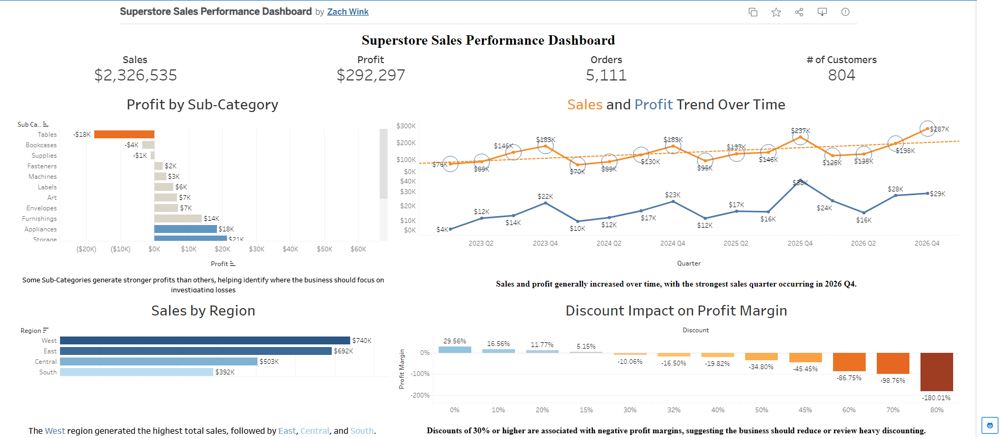

# Superstore Sales Performance Dashboard

## Executive Summary

This project analyzes 10,194 records from the Tableau Superstore dataset to evaluate sales performance, profitability, discount impact, regional trends, and product performance.

I cleaned and prepared the data in Excel, imported it into MySQL for analysis, and built an interactive Tableau Public dashboard to present the findings.

The strongest business insight was that discounts of 30% or higher were associated with negative profit margins. This suggests the business should review heavy discounting strategies and investigate products or sub-categories with weak profitability.

## Business Problem

The business needs to understand what is driving sales and profit performance across products, regions, customers, and discounts.

The main goal of this analysis was to answer:

- Which regions generate the most sales?
- Which categories and sub-categories are most profitable?
- Are discounts helping or hurting profitability?
- How are sales and profit trending over time?
- Which product areas should the business review?

## Tools Used

- Excel
- MySQL Workbench
- Tableau Public
- GitHub

## Dataset

- Source: Tableau Superstore dataset
- Rows analyzed: 10,194
- Data type: Retail sales data
- Key fields used:
  - Sales
  - Profit
  - Discount
  - Quantity
  - Order Date
  - Ship Date
  - Region
  - Category
  - Sub-Category
  - Product Name
  - Customer Name
  - State/Province

## Methodology

1. Cleaned the Superstore dataset in Excel.
2. Renamed fields for easier SQL use.
3. Exported the cleaned file as a CSV.
4. Imported the CSV into MySQL.
5. Converted text fields into usable numeric and date formats.
6. Wrote SQL queries to analyze sales, profit, discounts, regions, products, customers, and trends.
7. Built a Tableau dashboard to visualize the most important findings.
8. Created business recommendations based on the analysis.

## Key Business Questions

This project answered the following questions:

1. What are total sales, profit, orders, and quantity sold?
2. Which region generated the highest sales?
3. Which categories and sub-categories were most profitable?
4. How did sales and profit change over time?
5. Which discount levels were associated with negative profit margins?
6. Which products or sub-categories may need further review?
7. Which areas of the business should be prioritized for improvement?

## Key Insights

- Total sales were approximately $2.33M.
- Total profit was approximately $292K.
- The West region generated the highest total sales.
- Sales and profit generally increased over time.
- Discounts of 30% or higher were associated with negative profit margins.
- Some sub-categories generated stronger profits than others.
- Products and sub-categories with low or negative profit margins should be reviewed for pricing, discounting, or discontinuation.

## Recommendations

- Review discounts of 30% or higher because they are associated with negative profit margins.
- Investigate products and sub-categories with weak or negative profitability.
- Focus sales efforts on high-performing regions and profitable product areas.
- Monitor profit margin, not just total sales, because high sales do not always mean strong profitability.
- Continue tracking sales and profit trends over time to identify changes in business performance.

## Skills Demonstrated

- Excel data cleaning
- CSV preparation
- MySQL data import
- SQL aggregation
- SQL filtering
- `GROUP BY`
- `HAVING`
- `ORDER BY`
- Date functions
- CTEs
- Window functions using `LAG()`
- Profit margin analysis
- Tableau dashboard design
- KPI reporting
- Business insight communication

## Dashboard

[View Tableau Dashboard](https://public.tableau.com/app/profile/zach.wink/viz/SuperstoreSalesPerformanceDashboard_17831558232310/SuperstoreSalesPerformanceDash?publish=yes)

## Dashboard Preview

